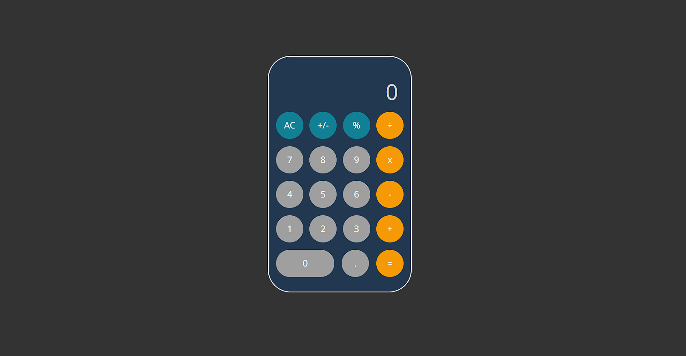

# Simple JavaScript Calculator

A simple JavaScript Calculator made by [Will Delorm](https://github.com/willdelorm).

## Overview

The Simple JavaScript Calculator is a straightforward web-based calculator built using JavaScript. It provides basic arithmetic operations to help users perform calculations quickly and efficiently.

## Usage

Access the Simple JavaScript Calculator here: [Simple JavaScript Calculator](https://willdelorm.github.io/simple-calculator/)

Simply enter your mathematical expressions and use the calculator's features to perform calculations with ease.

## Contributors

Contributors are always welcome to make contributions to this project and help improve it. If you'd like to contribute or work on available issues, feel free to do so. Let's collaborate and make this calculator even better!